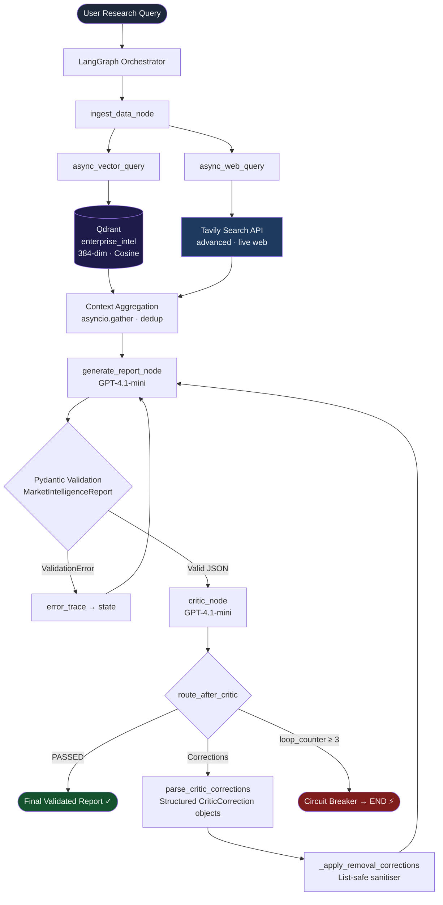
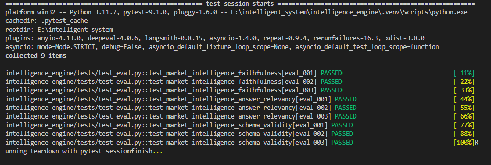

<div align="center">

# 🧠 Enterprise Market Intelligence Engine

### Autonomous Multi-Agent AI System for Real-Time Company Intelligence

*Concurrent hybrid retrieval · LLM generation · Critic-driven fact-checking · Automated correction loops*

---

[](https://www.python.org/)
[](https://github.com/langchain-ai/langgraph)
[](https://openai.com/)
[](https://qdrant.tech/)
[](https://github.com/confident-ai/deepeval)
[](./intelligence_engine/tests/)
[](./LICENSE)

</div>

---

## Overview

The **Enterprise Market Intelligence Engine** is a production-grade, multi-agent AI system that autonomously researches companies, synthesises structured intelligence reports, and validates every factual claim before publishing.

Given a natural-language research query — *"Analyse NVIDIA's AI chip market position heading into 2025"* — the system:

1. **Concurrently retrieves** relevant context from a local Qdrant vector database (internal knowledge base) and live web search via Tavily
2. **Generates** a structured JSON report using GPT-4.1-mini, validated against a strict Pydantic schema
3. **Fact-checks** every claim with a dedicated Critic agent that cross-references the report against retrieved ground truth
4. **Iteratively corrects** the report when claims are ungrounded, with a circuit breaker to prevent runaway loops
5. **Outputs** a final validated intelligence report with sources, risk factors, and revenue drivers

All of this runs asynchronously through a stateful LangGraph graph — observable, reproducible, and evaluated automatically with DeepEval.

---

## Why This Project Matters

Enterprise intelligence workflows today involve analysts manually searching the web, cross-referencing internal databases, synthesising findings into reports, and reviewing for accuracy — a process that takes hours per company.

This system automates that entire pipeline with production engineering principles:

- **Hallucination is not accepted** — a separate Critic agent rejects any claim not grounded in retrieved context
- **Schema violations auto-correct** — Pydantic validation failures are caught, logged, and fed back to the generator as explicit error traces
- **Retrieval is hybrid** — internal institutional knowledge (Qdrant) combined with real-time web data (Tavily) produces richer context than either source alone
- **Quality is measured** — DeepEval benchmarks (Faithfulness, Answer Relevancy) run against a curated golden dataset, making regressions impossible to miss

---

## Key Features

| Feature | Implementation |
|---|---|
| **Stateful Multi-Agent Graph** | LangGraph `StateGraph` with typed `AgentState` |
| **Concurrent Hybrid Retrieval** | `asyncio.gather` fires Qdrant + Tavily simultaneously |
| **Semantic Vector Search** | Qdrant with BAAI/bge-small-en-v1.5 (384-dim, FastEmbed) |
| **Live Web Search** | Tavily `advanced` search with source URL attribution |
| **Structured JSON Output** | Pydantic `MarketIntelligenceReport` with field-level validators |
| **Critic Fact-Checking** | Dedicated LLM agent cross-references every claim against context |
| **Automated Correction Loops** | Generator receives per-field structured corrections on failure |
| **Circuit Breaker** | Configurable max-loop guard prevents token-drain spirals |
| **Schema Error Recovery** | Validation tracebacks injected back into the next generation prompt |
| **Removal Instruction Sanitiser** | Post-LLM sanitiser prevents `List[str]` fields being corrupted by deletion instructions |
| **DeepEval Evaluation** | Faithfulness + AnswerRelevancy metrics against golden dataset |
| **Async Throughout** | All I/O — LLM, Qdrant, Tavily — is non-blocking |

---

## Architecture



---

## System Workflow

### 1 · Ingest (`ingest_data_node`)

Both retrieval operations fire in a single `asyncio.gather` call. Total latency equals `max(t_qdrant, t_tavily)` — not their sum.

```
asyncio.gather(
    async_vector_query(query),   # Qdrant: semantic search over internal KB
    async_web_query(query),      # Tavily: live web search with source URLs
)
→ combined: 11 deduplicated context chunks (vector-first priority)
```

### 2 · Generate (`generate_report_node`)

GPT-4.1-mini is prompted to produce a single valid JSON object conforming to `MarketIntelligenceReport`. On revision passes, the prompt is **mode-aware**: it shows the rejected draft verbatim alongside structured per-field correction mandates (not raw prose), so the model receives unambiguous replacement values.

```python
class MarketIntelligenceReport(BaseModel):
    company_name:            str
    market_cap_or_valuation: str
    core_revenue_drivers:    List[str]
    risk_factors:            List[str]
    sources:                 List[str]
```

### 3 · Validate (Pydantic)

The raw LLM output is first parsed to a dict, then passed through `_apply_removal_corrections()` (which handles deletion instructions on list fields without breaking schema types), then validated by Pydantic. Validation errors are stored in `error_trace` and injected into the next prompt.

### 4 · Critique (`critic_node`)

A separate LLM call cross-references every field against the retrieved context snippets. The critic must respond either with the exact string `PASSED` or with structured correction blocks:

```
Field: market_cap_or_valuation
Incorrect claim: "$3.3T as of Q1 2025"
Context says: "fiscal year 2025 revenue of approximately $130 billion"
Correct value: $130B revenue (FY2025); market cap ~$3.3T
```

### 5 · Route (`route_after_critic`)

| Condition | Action |
|---|---|
| `loop_counter >= CIRCUIT_BREAKER_MAX` | ⚡ END — publish best-effort draft |
| `error_trace is not None` | → Generator (schema fix) |
| `critic_feedback != 'PASSED'` | → Generator (factual fix) |
| `critic_feedback == 'PASSED'` | ✅ END — publish validated report |

---

## Hybrid Retrieval Pipeline

```
Query: "Analyse NVIDIA's AI chip market share"
           │
           ├─── Qdrant Semantic Search ────────────────────────────────┐
           │    · Collection : enterprise_intel                        │
           │    · Model     : BAAI/bge-small-en-v1.5 (FastEmbed)      │
           │    · Dim       : 384  ·  Distance : Cosine               │
           │    · Results   : 5 chunks from nvidia.txt                │
           │                                                           │
           └─── Tavily Web Search ─────────────────────────────────────┤
                · Depth     : advanced                                 │
                · Results   : 6 live web snippets + source URLs        │
                                                                       │
                        Context Aggregation (deduplication)            │
                        combined = 11 unique chunks ◄──────────────────┘
```

**Why hybrid?** Internal documents contain curated, structured institutional knowledge (revenue figures, product specs, competitive positioning). Live web search catches recent earnings releases, news events, and analyst commentary that postdate the knowledge base. Together they produce context that is both deep and current.


---

## Fact-Checking & Critic Loop

The Critic agent is the system's primary hallucination defence. It operates as a fully independent LLM call — separate system prompt, separate context window — which prevents the self-confirmation bias that occurs when a single model checks its own output.

**Correction parsing** is structural, not heuristic. The critic's prose is parsed into typed `CriticCorrection` objects:

```python
class CriticCorrection(BaseModel):
    field_name:    str        # which field is wrong
    rejected_value: str       # what the generator produced
    correct_value:  str       # what it should be
    evidence:       str       # supporting context quote
    is_removal:     bool      # deletion instruction (not a replacement value)
```

These are injected into the generator's revision prompt as a numbered MANDATORY VALUES checklist — not a block of prose the model can selectively ignore.

**The removal sanitiser** (`_apply_removal_corrections`) adds a third layer of defence: if the LLM still misinterprets a deletion instruction and sets `risk_factors = "Remove unsupported claim"` (a string, not a list), the sanitiser catches it, falls back to the previous draft's list, and surgically removes only the flagged item before Pydantic ever sees the output.


---

## Evaluation Results

All 9 DeepEval test cases pass across three metrics:

| Test | Metric | Threshold | Result |
|---|---|---|---|
| eval_001 · Faithfulness | Claims grounded in context | 0.50 | ✅ PASS |
| eval_002 · Faithfulness | Claims grounded in context | 0.50 | ✅ PASS |
| eval_003 · Faithfulness | Claims grounded in context | 0.50 | ✅ PASS |
| eval_001 · Answer Relevancy | Query addressed | 0.70 | ✅ PASS |
| eval_002 · Answer Relevancy | Query addressed | 0.70 | ✅ PASS |
| eval_003 · Answer Relevancy | Query addressed | 0.70 | ✅ PASS |
| eval_001 · Schema Validity | All Pydantic fields populated | 100% | ✅ PASS |
| eval_002 · Schema Validity | All Pydantic fields populated | 100% | ✅ PASS |
| eval_003 · Schema Validity | All Pydantic fields populated | 100% | ✅ PASS |



---

## Screenshots

### Final Validated Report


### Qdrant Dashboard


---

## Performance Metrics

```
Hybrid Retrieval
────────────────
  vector_hits  : 5   (Qdrant semantic search)
  web_hits     : 6   (Tavily live web)
  combined     : 11  (deduplicated, vector-first)

Qdrant Collection
─────────────────
  Name         : enterprise_intel
  Documents    : 10 company knowledge base files
  Dimensions   : 384  (BAAI/bge-small-en-v1.5)
  Distance     : Cosine

Critic Validation
─────────────────
  Result       : PASSED
  Loops        : 1

Evaluation Suite
────────────────
  Framework    : DeepEval
  Test cases   : 9 / 9 passed
  Metrics      : Faithfulness · Answer Relevancy · Schema Validity
```

---

## Installation

### Prerequisites

- Python 3.11+
- Docker (for Qdrant)
- OpenAI API key
- Tavily API key

### 1 · Clone

```bash
git clone https://github.com/your-username/enterprise-market-intelligence-engine.git
cd enterprise-market-intelligence-engine
```

### 2 · Create virtual environment

```bash
python -m venv .venv

# macOS / Linux
source .venv/bin/activate

# Windows
.venv\Scripts\activate
```

### 3 · Install dependencies

```bash
pip install -r intelligence_engine/requirements.txt
```

---

## Configuration

Create a `.env` file in the `intelligence_engine/` directory:

```env
# Required
OPENAI_API_KEY=sk-your-openai-key-here
TAVILY_API_KEY=tvly-your-tavily-key-here

# Qdrant (defaults shown — change for Qdrant Cloud)
QDRANT_URL=http://localhost:6333
# QDRANT_API_KEY=           # only needed for Qdrant Cloud

# Optional tuning
QDRANT_COLLECTION=enterprise_intel
LLM_MODEL=gpt-4.1-mini
LLM_TEMPERATURE=0
MAX_SEARCH_RESULTS=5
MAX_VECTOR_RESULTS=5
CIRCUIT_BREAKER_MAX=3
```

> **Note:** `OPENAI_API_KEY` is used by both the intelligence pipeline (generator + critic) and DeepEval's judge model. A single key covers everything.

---

## Starting Qdrant

```bash
docker run -d \
  --name qdrant \
  -p 6333:6333 \
  -v qdrant_storage:/qdrant/storage \
  qdrant/qdrant
```

Verify it is running:

```bash
curl http://localhost:6333/collections
# → {"result":{"collections":[]},"status":"ok","time":...}
```

Qdrant dashboard: [http://localhost:6333/dashboard](http://localhost:6333/dashboard)

---

## Document Ingestion

The ingestion script reads all `.txt` files from `sample_documents/`, chunks them into overlapping 512-word windows, embeds them locally with FastEmbed (`BAAI/bge-small-en-v1.5`, 384-dim), and upserts them into Qdrant.

```bash
cd intelligence_engine

# Ingest the included sample documents (10 companies)
python ingest_documents.py

# Custom documents directory
python ingest_documents.py --docs-dir /path/to/your/docs

# Custom collection name
python ingest_documents.py --collection my_collection
```

Expected output:

```
Connecting to Qdrant at http://localhost:6333 …
Qdrant connection OK.
Created collection 'enterprise_intel' (dim=384, distance=Cosine).
Loading documents from sample_documents …
Loaded nvidia.txt      → 1 chunk(s)
Loaded openai.txt      → 1 chunk(s)
...
Loaded 10 document(s) total.
Uploading 10 point(s) in batches of 32 …
  Upserted points 1–10 / 10
✓ Collection : enterprise_intel
✓ Points     : 10
✓ Dimensions : 384
✓ Distance   : Cosine
Ingestion complete. 10 point(s) in collection 'enterprise_intel'.
```

**Included companies:** Amazon · AMD · Anthropic · Databricks · Google · Microsoft · NVIDIA · OpenAI · Palantir · Snowflake

---

## Running the Application

```bash
cd intelligence_engine
python main.py
```

The terminal output shows every node transition in real time:

```
╔══════════════════════════════════════════════════════════════════════╗
║   Automated Enterprise Market Intelligence & Fact-Checking Engine    ║
║   Powered by LangGraph · Qdrant · Tavily · OpenAI GPT-4.1-mini     ║
╚══════════════════════════════════════════════════════════════════════╝

Research Query:
  Provide a comprehensive market intelligence analysis of NVIDIA Corporation...

[▶ NODE]  INGEST_DATA
  Retrieved 11 context chunks total.
[✓ NODE]  INGEST_DATA completed in 1.43s

[▶ NODE]  GENERATE_REPORT
  ✓ Generated report for: NVIDIA Corporation
[✓ NODE]  GENERATE_REPORT completed in 5.21s

[▶ NODE]  CRITIC
  ✓ Fact-check PASSED — all claims grounded.
[✓ NODE]  CRITIC completed in 2.87s

Total pipeline elapsed time: 9.51s
Total critic loops completed: 1

══════════════════════════════════════════════════════════════════════
  ✅  FINAL VALIDATED MARKET INTELLIGENCE REPORT
══════════════════════════════════════════════════════════════════════

Company:       NVIDIA Corporation
Valuation:     ~$3.3T market cap (FY2025)

Core Revenue Drivers:
  1. Data center GPU sales (H100/H200/Blackwell) — $115B+ in FY2025
  2. CUDA software ecosystem moat (80–85% AI training market share)
  3. Automotive DRIVE platform growing 50%+ annually

Risk Factors:
  1. Customer concentration — Microsoft, Google, Amazon, Meta ~40% of DC revenue
  2. US export controls limiting China sales (~$10–15B annual impact)
  3. TSMC fab concentration introducing geopolitical supply chain risk

Sources:
  • [https://investor.nvidia.com/...] NVIDIA FY2025 Earnings Release
  • [https://...] Blackwell architecture announcement
```

---

## Running Evaluations

```bash
cd intelligence_engine

# Run all 9 evaluation tests
pytest tests/test_eval.py -v

# Run a specific metric
pytest tests/test_eval.py -v -k "faithfulness"
pytest tests/test_eval.py -v -k "schema_validity"
```

Expected output:

```
collected 9 items

tests/test_eval.py::test_market_intelligence_faithfulness[eval_001] PASSED
tests/test_eval.py::test_market_intelligence_faithfulness[eval_002] PASSED
tests/test_eval.py::test_market_intelligence_faithfulness[eval_003] PASSED
tests/test_eval.py::test_market_intelligence_answer_relevancy[eval_001] PASSED
tests/test_eval.py::test_market_intelligence_answer_relevancy[eval_002] PASSED
tests/test_eval.py::test_market_intelligence_answer_relevancy[eval_003] PASSED
tests/test_eval.py::test_market_intelligence_schema_validity[eval_001] PASSED
tests/test_eval.py::test_market_intelligence_schema_validity[eval_002] PASSED
tests/test_eval.py::test_market_intelligence_schema_validity[eval_003] PASSED

9 passed in 186.58s
```

---

## Repository Structure

```
enterprise-market-intelligence-engine/
│
├── intelligence_engine/
│   ├── config.py               # pydantic-settings config + ChatOpenAI init
│   ├── schema.py               # MarketIntelligenceReport, CriticCorrection, AgentState
│   ├── graph.py                # LangGraph StateGraph: all nodes + circuit breaker
│   ├── main.py                 # CLI entry point with streaming node logs
│   ├── ingest_documents.py     # One-shot Qdrant ingestion with FastEmbed
│   │
│   ├── tools/
│   │   ├── web_search.py       # async_web_query() → Tavily SDK
│   │   └── vector_search.py    # async_vector_query() → AsyncQdrantClient
│   │
│   ├── tests/
│   │   ├── test_eval.py        # pytest + DeepEval: Faithfulness · Relevancy · Schema
│   │   └── test_golden_dataset.json   # 3 curated evaluation scenarios
│   │
│   ├── sample_documents/       # 10 company .txt knowledge base files
│   └── requirements.txt
│
├── assets/                     # Screenshots and diagrams
└── README.md
```

---

## Technical Highlights

### LangGraph Stateful Orchestration

The entire pipeline is a `StateGraph(AgentState)` — a typed, persistent state machine where each node returns a partial dict that LangGraph merges. This enables clean retry loops, observable state at every step, and a conditional router (`route_after_critic`) with circuit breaker logic, all without any manual state management code.

### AsyncIO Concurrent Retrieval

```python
vector_results, web_results = await asyncio.gather(
    async_vector_query(query),
    async_web_query(query),
)
```

Both retrieval operations fire simultaneously. Total ingest latency equals `max(t_qdrant, t_tavily)`, not their sum — a meaningful latency saving on every pipeline run.

### Hybrid RAG

Two retrieval sources with complementary strengths: Qdrant provides deep, structured institutional knowledge (curated company profiles with specific figures); Tavily provides recency (live earnings releases, news, analyst commentary). Results are merged with vector-first ordering so the higher-precision internal KB is weighted earlier in the context window.

### FastEmbed Local Embeddings

Document ingestion uses `BAAI/bge-small-en-v1.5` via FastEmbed — an ONNX-based local inference library. No embedding API calls, no per-token costs, no network dependency for ingestion. The same model produces consistent 384-dimensional cosine vectors at search time via `query_points`.

### Pydantic Structured Validation

`MarketIntelligenceReport` enforces non-empty lists, non-blank strings, and minimum field counts at the schema level. Validation happens on the raw dict (after the `_apply_removal_corrections` sanitiser) so the error messages are precise and actionable for the next generation prompt.

### DeepEval Evaluation

Three independent test categories — Faithfulness, Answer Relevancy, Schema Validity — run against a golden dataset of curated scenarios with known-good retrieval contexts. The same `OPENAI_API_KEY` that powers the pipeline is used by DeepEval's GPT-4o judge, so no additional credentials are needed.

---

## Challenges Solved

### Hallucination Reduction

**Problem:** LLMs freely fabricate market cap figures, product names, and dates when context is ambiguous.

**Solution:** A fully independent Critic agent cross-references every claim against the retrieved ground-truth snippets in a separate LLM call, eliminating the self-confirmation bias of a model checking its own output. Claims not grounded in retrieved context are rejected with specific field-level corrections.

### Hybrid Retrieval Quality

**Problem:** A vector database alone lacks recency; live web search alone lacks depth and precision.

**Solution:** `asyncio.gather` fires both concurrently. Results are merged with vector-first priority (higher precision) and deduplicated. The combined context gives the generator access to both curated structured knowledge and live market data.

### Structured Validation at the LLM Boundary

**Problem:** LLMs frequently produce malformed JSON — markdown fences, wrong types, missing fields — despite explicit instructions.

**Solution:** A three-layer pipeline: markdown fence stripping → `_apply_removal_corrections` dict sanitiser → `MarketIntelligenceReport.model_validate()`. Each layer catches a distinct failure class. Validation errors are serialised as tracebacks and injected into the next prompt as explicit constraints.

### Critic Convergence

**Problem:** The critic and generator can loop indefinitely — critic rejects, generator revises to the same wrong value, critic rejects again.

**Solution:** The critic's prose is parsed into typed `CriticCorrection` objects with `field_name`, `correct_value`, and `is_removal` fields. On revision passes the generator receives a numbered MANDATORY VALUES checklist — not prose — so replacement values are unambiguous. A prior-mandates block tells the critic to accept any field that already matches a value it previously specified.

### Automated Correction Loops

**Problem:** When the critic instructs "Remove unsupported claim" on a `List[str]` field, a naive LLM sets the entire field to the string `"Remove unsupported claim"`, causing a Pydantic `ValidationError` that consumes a correction loop without making progress.

**Solution:** `is_removal: bool` is parsed from the correction. The prompt instruction changes from `"← USE THIS EXACTLY"` to `"REMOVE the specific list item… The field MUST remain a JSON array"`. `_apply_removal_corrections` runs post-LLM as a deterministic fallback: if the field is still a string, it restores the previous draft's list and deletes only the flagged item.

---

## Future Improvements

- **LangFuse Observability** — per-run token traces, latency dashboards, and correction-loop visualisation
- **GitHub Actions CI/CD** — automated DeepEval evaluation on every push with threshold gating
- **Multi-Vector Retrieval** — separate dense and sparse (BM25) vectors per document for hybrid search with RRF fusion
- **Source Quality Ranking** — score retrieval sources by recency, domain authority, and citation frequency before context assembly
- **Multi-Critic Evaluation** — ensemble of critic agents with majority-vote acceptance to reduce single-model bias
- **Streaming Output** — stream the generator's token output to the terminal for lower perceived latency
- **Qdrant Cloud Support** — managed collection with authentication for team deployments
- **RAG-as-a-Service API** — FastAPI wrapper exposing the pipeline as a REST endpoint

---

## Skills Demonstrated

| Domain | Technologies & Techniques |
|---|---|
| **LLM Engineering** | Prompt design, structured output, mode-aware revision prompts, JSON schema enforcement |
| **Agentic AI** | Multi-agent orchestration, stateful workflows, conditional routing, circuit breakers |
| **RAG Systems** | Hybrid retrieval, context aggregation, deduplication, vector-first priority ordering |
| **Vector Databases** | Qdrant collection management, cosine similarity, payload filtering, batch upsert |
| **Evaluation Frameworks** | DeepEval Faithfulness + AnswerRelevancy metrics, golden dataset curation, threshold CI |
| **Backend Engineering** | AsyncIO concurrency, Pydantic validation, pydantic-settings 12-factor config |
| **Prompt Engineering** | First-pass vs revision mode prompts, structured correction checklists, convergence rules |
| **Production Reliability** | Graceful degradation, error tracebacks in state, removal sanitiser, schema recovery loops |

---

## License

[MIT](./LICENSE) — free to use, modify, and distribute with attribution.

---

<div align="center">

*Built as a production-grade demonstration of multi-agent AI engineering, hybrid RAG, and evaluation-driven development.*

</div>
