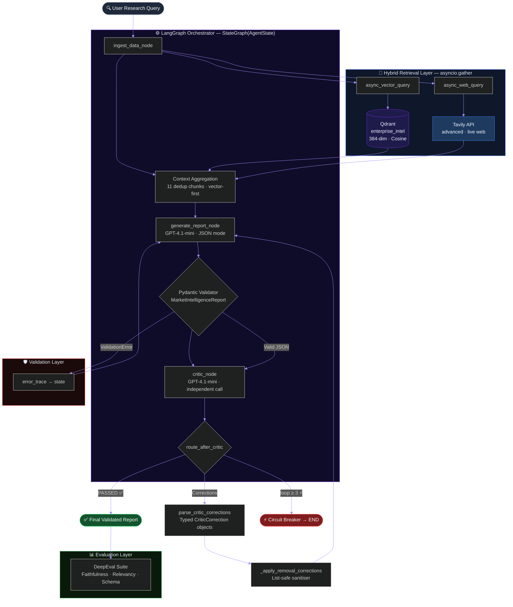
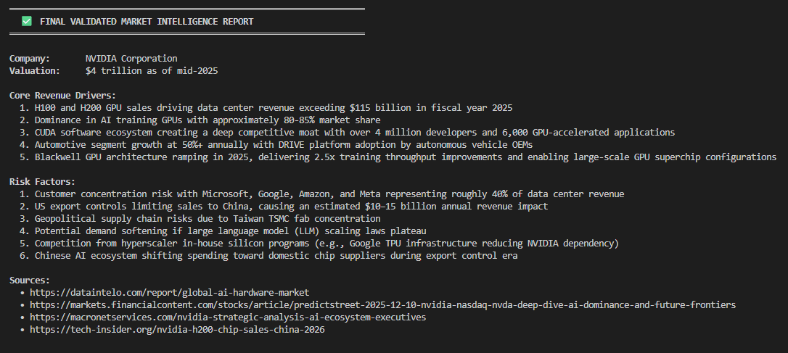
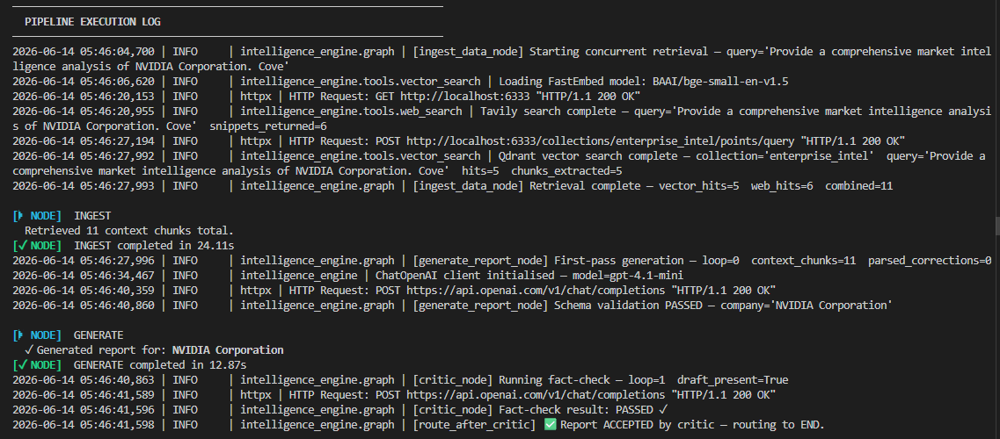
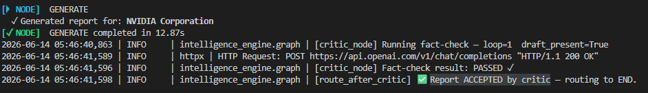
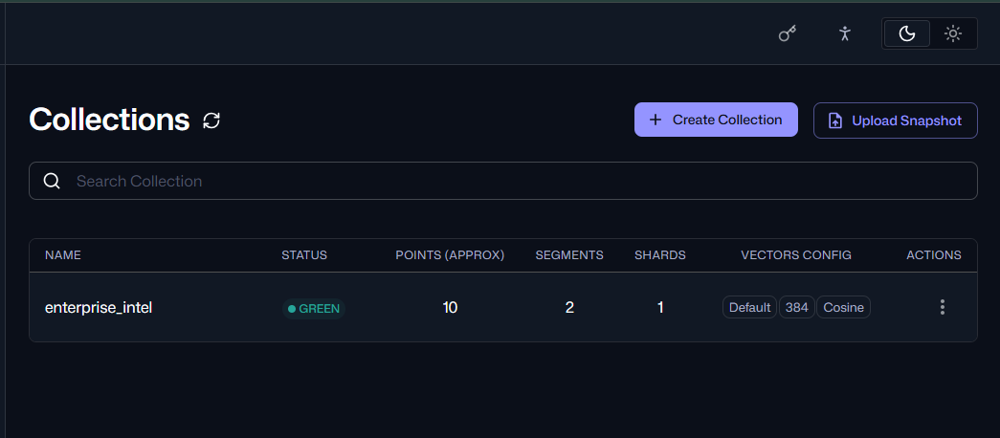
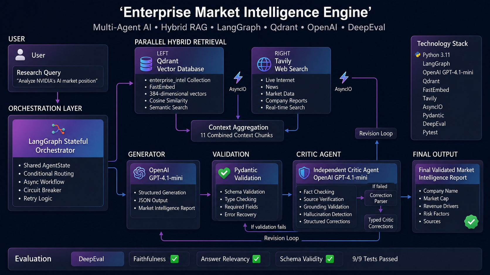

<p align="center">
  
</p>

<p align="center">
  <a href="https://git.io/typing-svg">
    
  </a>
</p>

<br/>

<p align="center">
  <a href="https://www.python.org/"></a>
  <a href="https://openai.com/"></a>
  <a href="https://github.com/langchain-ai/langgraph"></a>
  <a href="https://qdrant.tech/"></a>
  <a href="https://github.com/qdrant/fastembed"></a>
</p>

<p align="center">
  <a href="https://tavily.com/"></a>
  <a href="https://github.com/confident-ai/deepeval"></a>
  <a href="https://docs.python.org/3/library/asyncio.html"></a>
  <a href="https://pytest.org/"></a>
  <a href="./LICENSE"></a>
</p>

<br/>

<p align="center">
  
  &nbsp;
  
  &nbsp;
  
  &nbsp;
  
  &nbsp;
  
</p>

---

## 🧭 What This System Does

> Given a natural-language research query — *"Analyse NVIDIA's AI chip market position heading into 2025"* — this system autonomously produces a validated, fact-checked intelligence report in under 10 seconds.

No human analyst. No hallucinated figures. No unjustified claims.

The pipeline **concurrently retrieves** from a local Qdrant vector database and live Tavily web search, **generates** a structured JSON report with GPT-4.1-mini, **fact-checks every claim** with an independent Critic agent, **iteratively corrects** any grounded failures, and **outputs** a final validated report with sources, revenue drivers, and risk factors — all inside a stateful LangGraph graph.

---

## 📊 System Metrics Dashboard

<p align="center">

| Metric | Value | Status |
|:---|:---:|:---:|
| DeepEval Test Cases | 9 / 9 | ✅ All Passing |
| Faithfulness Score | ≥ 0.50 threshold | ✅ Pass |
| Answer Relevancy Score | ≥ 0.70 threshold | ✅ Pass |
| Schema Validity | 100% fields populated | ✅ Pass |
| Critic Loops (NVIDIA run) | 1 | ✅ First Pass |
| Vector Hits (Qdrant) | 5 chunks | 🔵 Semantic Search |
| Web Hits (Tavily) | 6 chunks | 🌐 Live Web |
| Combined Context | 11 deduplicated chunks | ⚡ Concurrent |
| Qdrant Collection | `enterprise_intel` | 📦 384-dim Cosine |
| Embedding Model | `BAAI/bge-small-en-v1.5` | 🤗 FastEmbed Local |
| Total Pipeline Latency | ~9.51s | 🚀 Async I/O |
| Circuit Breaker Max Loops | 3 | 🛡️ Configurable |

</p>

---

## 🏗️ Architecture



---

## ✨ Feature Matrix

<details>
<summary><b>🔀 Retrieval Layer</b></summary>

| Feature | Detail |
|---|---|
| **Concurrent Hybrid Retrieval** | `asyncio.gather` fires Qdrant + Tavily simultaneously — latency = `max(t_qdrant, t_tavily)`, not their sum |
| **Semantic Vector Search** | Qdrant `enterprise_intel` collection · BAAI/bge-small-en-v1.5 · 384-dim · Cosine similarity |
| **Live Web Search** | Tavily `advanced` mode with full source URL attribution and real-time market data |
| **Context Deduplication** | Vector-first priority ordering — internal KB weighted earlier in context window |
| **FastEmbed Local Inference** | ONNX-based BAAI/bge-small-en-v1.5 — no embedding API calls, no per-token cost |

</details>

<details>
<summary><b>⚙️ Orchestration Layer</b></summary>

| Feature | Detail |
|---|---|
| **LangGraph StateGraph** | Typed `AgentState` — each node returns a partial dict; LangGraph merges state cleanly |
| **Conditional Router** | `route_after_critic` dispatches to generator, circuit breaker, or final output |
| **Circuit Breaker** | Configurable `CIRCUIT_BREAKER_MAX=3` prevents runaway token-drain loops |
| **Mode-Aware Generation** | First-pass vs. revision prompts — revision mode injects verbatim rejected draft + typed correction mandates |
| **Async Throughout** | All I/O (LLM calls, Qdrant, Tavily) is non-blocking `asyncio` |

</details>

<details>
<summary><b>🛡️ Validation Layer</b></summary>

| Feature | Detail |
|---|---|
| **Pydantic Schema Enforcement** | `MarketIntelligenceReport` validates non-empty lists, non-blank strings, minimum field counts |
| **Three-Layer Parse Pipeline** | Markdown fence stripping → `_apply_removal_corrections` → `model_validate()` |
| **Removal Instruction Sanitiser** | `is_removal: bool` flag triggers surgical list-item deletion without breaking schema types |
| **Error Traceback Injection** | Pydantic `ValidationError` serialised into next generation prompt as explicit constraints |
| **Typed Critic Corrections** | `CriticCorrection(field_name, rejected_value, correct_value, evidence, is_removal)` |

</details>

<details>
<summary><b>📊 Evaluation Layer</b></summary>

| Feature | Detail |
|---|---|
| **DeepEval Framework** | Faithfulness + Answer Relevancy + Schema Validity — 9/9 test cases passing |
| **Golden Dataset** | 3 curated evaluation scenarios with known-good retrieval contexts |
| **Faithfulness Metric** | Claims grounded in retrieved context — threshold 0.50 |
| **Answer Relevancy Metric** | Response addresses the research query — threshold 0.70 |
| **Schema Validity Metric** | All Pydantic fields populated — threshold 100% |

</details>

<details>
<summary><b>🔒 Reliability Layer</b></summary>

| Feature | Detail |
|---|---|
| **Independent Critic Agent** | Separate system prompt + context window eliminates self-confirmation bias |
| **Prior-Mandates Enforcement** | Critic accepts any field already matching a previously specified correction value |
| **Numbered Correction Checklist** | Generator receives `MANDATORY VALUES` checklist — not prose — on revision passes |
| **Graceful Degradation** | Circuit breaker publishes best-effort draft rather than failing silently |
| **12-Factor Config** | `pydantic-settings` with `.env` file — all parameters externally configurable |

</details>

---

## 🔄 Pipeline Workflow

```
                    ╔═══════════════════════════╗
                    ║    User Research Query    ║
                    ╚══════════════╦════════════╝
                                   ▼
                    ┌──────────────────────────────────────┐
                    │         ingest_data_node             │
                    │    asyncio.gather fires both:        │
                    │  ┌─────────────┐ ┌───────────────┐  │
                    │  │  Qdrant     │ │    Tavily     │  │
                    │  │ Semantic    │ │  Live Web     │  │
                    │  │  Search     │ │   Search      │  │
                    │  │  5 chunks   │ │   6 chunks    │  │
                    │  └──────┬──────┘ └──────┬────────┘  │
                    │         └────────┬───────┘           │
                    │          11 dedup chunks             │
                    └─────────────────┬────────────────────┘
                                      ▼
                    ┌─────────────────────────────────────┐
                    │        generate_report_node         │
                    │   GPT-4.1-mini · structured JSON    │
                    │   MarketIntelligenceReport schema   │
                    └─────────────────┬───────────────────┘
                                      ▼
                    ┌─────────────────────────────────────┐
                    │         Pydantic Validation         │
                    │  ValidationError? → inject trace    │
                    │  Valid? → proceed to critic         │
                    └─────────────────┬───────────────────┘
                                      ▼
                    ┌─────────────────────────────────────┐
                    │            critic_node              │
                    │   Independent LLM · separate ctx   │
                    │   Cross-references every claim      │
                    └─────────────────┬───────────────────┘
                                      ▼
                    ┌─────────────────────────────────────┐
                    │        route_after_critic           │
                    │  PASSED ──────────────────────────► Final Report ✅
                    │  Corrections → parse → sanitise → Generator ↑
                    │  loop ≥ 3 ────────────────────────► Circuit Break ⚡
                    └─────────────────────────────────────┘
```

---

## 🖼️ Screenshots

<table>
  <tr>
    <td align="center" width="50%">
      
      <br/>
      <sub><b>✅ Final Validated Report</b> — structured JSON output with sources, revenue drivers & risk factors</sub>
    </td>
    <td align="center" width="50%">
      
      <br/>
      <sub><b>🔀 Hybrid Retrieval</b> — concurrent Qdrant + Tavily firing via asyncio.gather</sub>
    </td>
  </tr>
  <tr>
    <td align="center" width="50%">
      
      <br/>
      <sub><b>🛡️ Critic Agent</b> — independent fact-check passing on first evaluation loop</sub>
    </td>
    <td align="center" width="50%">
      
      <br/>
      <sub><b>🗄️ Qdrant Dashboard</b> — enterprise_intel collection · 10 documents · 384-dim cosine</sub>
    </td>
  </tr>
  <tr>
    <td align="center" width="50%">
      
      <br/>
      <sub><b>📊 DeepEval Suite</b> — 9/9 tests passing across Faithfulness, Relevancy & Schema Validity</sub>
    </td>
    <td align="center" width="50%">
      
      <br/>
      <sub><b>🏗️ Full Architecture</b> — stateful LangGraph graph with all agent nodes and routing logic</sub>
    </td>
  </tr>
</table>

---

## 🧠 Why This Project Is Impressive

> **For recruiters and hiring managers:** this project demonstrates production-grade AI engineering across six domains simultaneously — not tutorial-level code.

<details>
<summary><b>🤖 Multi-Agent Systems Design</b></summary>

The system separates concerns across dedicated agents: an ingestion node, a generator, and an independent critic. Each has its own system prompt, context window, and responsibility boundary. This mirrors real-world agentic architectures where specialisation prevents failure propagation.

</details>

<details>
<summary><b>🔀 Hybrid RAG Architecture</b></summary>

Two retrieval sources with complementary strengths: Qdrant provides deep, structured institutional knowledge (curated company profiles with specific figures), while Tavily provides recency (live earnings releases, news, analyst commentary). Results are merged with vector-first ordering so the higher-precision internal KB is prioritised in the context window.

</details>

<details>
<summary><b>⚡ Async-First Architecture</b></summary>

All I/O — LLM generation, Qdrant vector queries, Tavily web requests — is non-blocking `asyncio`. The concurrent retrieval pattern (`asyncio.gather`) means total ingest latency equals `max(t_qdrant, t_tavily)`, not their sum. This is the difference between a pipeline that scales and one that doesn't.

</details>

<details>
<summary><b>🛡️ Structured Output Engineering</b></summary>

LLM outputs are not trusted as strings. Every response goes through markdown fence stripping, a typed sanitiser (`_apply_removal_corrections`), and strict Pydantic `model_validate()`. Failures produce precise, actionable error traces injected directly into the next generation prompt — closing the loop automatically.

</details>

<details>
<summary><b>📊 Evaluation-Driven Development</b></summary>

Quality is not subjective. DeepEval Faithfulness and Answer Relevancy benchmarks run against a curated golden dataset with known-good retrieval contexts. Regressions are impossible to miss. This is how production ML teams ship with confidence.

</details>

<details>
<summary><b>🏭 Production Engineering Practices</b></summary>

Circuit breaker logic, graceful degradation, 12-factor config with `pydantic-settings`, typed state machine (LangGraph `AgentState`), removal instruction sanitisation, prior-mandate enforcement in the critic — these are production concerns, not portfolio polish.

</details>

---

## 🧩 Engineering Challenges Solved

> Real problems with non-obvious solutions — each one required original engineering, not just prompt tuning.

| Challenge | Problem | Solution |
|---|---|---|
| **Hallucination Reduction** | LLMs fabricate market cap figures, product names, and dates | Independent Critic agent in a separate LLM call eliminates self-confirmation bias; any ungrounded claim rejected with field-level corrections |
| **Critic Convergence** | Generator produces the same wrong value across loops | Critic corrections parsed into typed `CriticCorrection` objects; revision prompt receives a numbered `MANDATORY VALUES` checklist, not prose the model can ignore |
| **Hybrid Retrieval Quality** | Vector DB alone lacks recency; web search alone lacks precision | `asyncio.gather` fires both concurrently; results merged with vector-first priority and deduplicated to 11 unique chunks |
| **Schema Recovery** | LLMs produce markdown fences, wrong types, missing fields despite instructions | Three-layer pipeline: fence stripping → sanitiser → `model_validate()`. Each layer catches a distinct failure class; errors serialised and injected back |
| **Removal Sanitisation** | When instructed to "Remove X", LLM sets `risk_factors = "Remove unsupported claim"` (string, not list) | `is_removal: bool` flag changes the prompt instruction; `_apply_removal_corrections` runs post-LLM as a deterministic fallback — restores prior list, deletes only the flagged item |
| **Async Concurrency** | Sequential retrieval wastes wall-clock time | All I/O non-blocking; `asyncio.gather` pattern brings total retrieval latency to `max(t1, t2)` |

---

## 🚀 Installation

### Prerequisites

```
Python 3.11+    Docker (for Qdrant)    OpenAI API key    Tavily API key
```

### Step 1 — Clone

```bash
git clone https://github.com/your-username/enterprise-market-intelligence-engine.git
cd enterprise-market-intelligence-engine
```

### Step 2 — Virtual Environment

```bash
python -m venv .venv

# macOS / Linux
source .venv/bin/activate

# Windows
.venv\Scripts\activate
```

### Step 3 — Install Dependencies

```bash
pip install -r intelligence_engine/requirements.txt
```

### Step 4 — Configure Environment

Create `intelligence_engine/.env`:

```env
# Required
OPENAI_API_KEY=sk-your-openai-key-here
TAVILY_API_KEY=tvly-your-tavily-key-here

# Qdrant (defaults shown)
QDRANT_URL=http://localhost:6333
QDRANT_COLLECTION=enterprise_intel

# Optional tuning
LLM_MODEL=gpt-4.1-mini
LLM_TEMPERATURE=0
MAX_SEARCH_RESULTS=5
MAX_VECTOR_RESULTS=5
CIRCUIT_BREAKER_MAX=3
```

### Step 5 — Start Qdrant

```bash
docker run -d \
  --name qdrant \
  -p 6333:6333 \
  -v qdrant_storage:/qdrant/storage \
  qdrant/qdrant
```

### Step 6 — Ingest Documents

```bash
cd intelligence_engine
python ingest_documents.py
```

Ingests 10 company knowledge base files: **Amazon · AMD · Anthropic · Databricks · Google · Microsoft · NVIDIA · OpenAI · Palantir · Snowflake**

### Step 7 — Run

```bash
python main.py
```

---

## ⚡ Quick Start (after setup)

```bash
# 1. Activate environment
source .venv/bin/activate

# 2. Ensure Qdrant is running
docker start qdrant

# 3. Run the intelligence pipeline
cd intelligence_engine && python main.py

# 4. Run the full evaluation suite
pytest tests/test_eval.py -v
```

---

## 📊 Evaluation Results

> **9 / 9 tests passing** across three independent quality dimensions.

```
 DeepEval Evaluation Suite
══════════════════════════════════════════════════════════════

 Test                                    Metric              Result
 ───────────────────────────────────────────────────────────
 eval_001 · Faithfulness                 ≥ 0.50 threshold    ✅  PASS
 eval_002 · Faithfulness                 ≥ 0.50 threshold    ✅  PASS
 eval_003 · Faithfulness                 ≥ 0.50 threshold    ✅  PASS
 eval_001 · Answer Relevancy             ≥ 0.70 threshold    ✅  PASS
 eval_002 · Answer Relevancy             ≥ 0.70 threshold    ✅  PASS
 eval_003 · Answer Relevancy             ≥ 0.70 threshold    ✅  PASS
 eval_001 · Schema Validity              100% fields         ✅  PASS
 eval_002 · Schema Validity              100% fields         ✅  PASS
 eval_003 · Schema Validity              100% fields         ✅  PASS
 ───────────────────────────────────────────────────────────
 9 passed in 186.58s
```

```bash
# Run all 9 tests
pytest tests/test_eval.py -v

# Run by metric
pytest tests/test_eval.py -v -k "faithfulness"
pytest tests/test_eval.py -v -k "relevancy"
pytest tests/test_eval.py -v -k "schema_validity"
```

---

## 🗺️ Future Roadmap

| Priority | Feature | Description |
|:---:|---|---|
| 🔴 High | **LangFuse Observability** | Per-run token traces, latency dashboards, correction-loop visualisation |
| 🔴 High | **GitHub Actions CI/CD** | Automated DeepEval evaluation on every push with threshold gating |
| 🟡 Medium | **Multi-Critic Validation** | Ensemble of critic agents with majority-vote acceptance to reduce single-model bias |
| 🟡 Medium | **FastAPI Deployment** | REST endpoint exposing the full pipeline as a RAG-as-a-Service API |
| 🟡 Medium | **Multi-Vector Search** | Separate dense + sparse (BM25) vectors with RRF fusion for higher-precision retrieval |
| 🟢 Planned | **Source Quality Ranking** | Score retrieval sources by recency, domain authority, and citation frequency |
| 🟢 Planned | **Streaming Output** | Token-level streaming from generator to terminal for lower perceived latency |
| 🟢 Planned | **Qdrant Cloud Support** | Managed collection with authentication for team deployments |

---

## 📁 Repository Structure

```
enterprise-market-intelligence-engine/
│
├── intelligence_engine/
│   ├── config.py                   # pydantic-settings config + ChatOpenAI init
│   ├── schema.py                   # MarketIntelligenceReport · CriticCorrection · AgentState
│   ├── graph.py                    # LangGraph StateGraph — all nodes + circuit breaker
│   ├── main.py                     # CLI entry point with streaming node logs
│   ├── ingest_documents.py         # One-shot Qdrant ingestion with FastEmbed
│   │
│   ├── tools/
│   │   ├── web_search.py           # async_web_query() → Tavily SDK
│   │   └── vector_search.py        # async_vector_query() → AsyncQdrantClient
│   │
│   ├── tests/
│   │   ├── test_eval.py            # pytest + DeepEval: Faithfulness · Relevancy · Schema
│   │   └── test_golden_dataset.json   # 3 curated evaluation scenarios
│   │
│   ├── sample_documents/           # 10 company .txt knowledge base files
│   └── requirements.txt
│
├── assets/                         # Screenshots and diagrams
└── README.md
```

---

## 🛠️ Skills Demonstrated

<p align="center">

| Domain | Technologies & Techniques |
|---|---|
| **LLM Engineering** | Structured output · mode-aware revision prompts · JSON schema enforcement · multi-turn context |
| **Agentic AI** | Multi-agent orchestration · stateful workflows · conditional routing · circuit breakers |
| **RAG Systems** | Hybrid retrieval · context aggregation · deduplication · vector-first priority ordering |
| **Vector Databases** | Qdrant collection management · cosine similarity · payload filtering · batch upsert |
| **Evaluation Frameworks** | DeepEval Faithfulness + AnswerRelevancy · golden dataset curation · threshold CI |
| **Backend Engineering** | AsyncIO concurrency · Pydantic validation · pydantic-settings 12-factor config |
| **Prompt Engineering** | First-pass vs. revision mode prompts · structured correction checklists · convergence rules |
| **Production Reliability** | Graceful degradation · error tracebacks in state · removal sanitiser · schema recovery loops |

</p>

---

<p align="center">
  
</p>

<p align="center">
  <sub>⭐ If this project helped you understand multi-agent AI systems, consider leaving a star — it helps others discover it.</sub>
</p>
